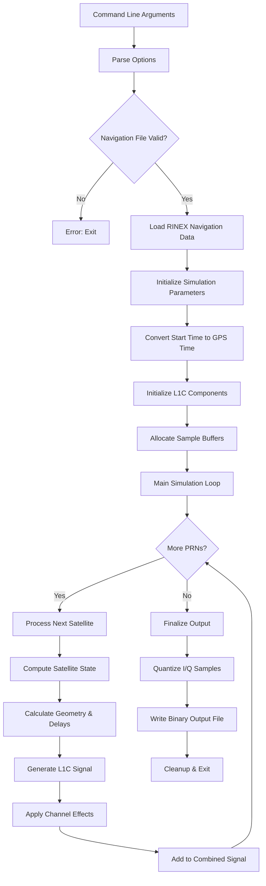
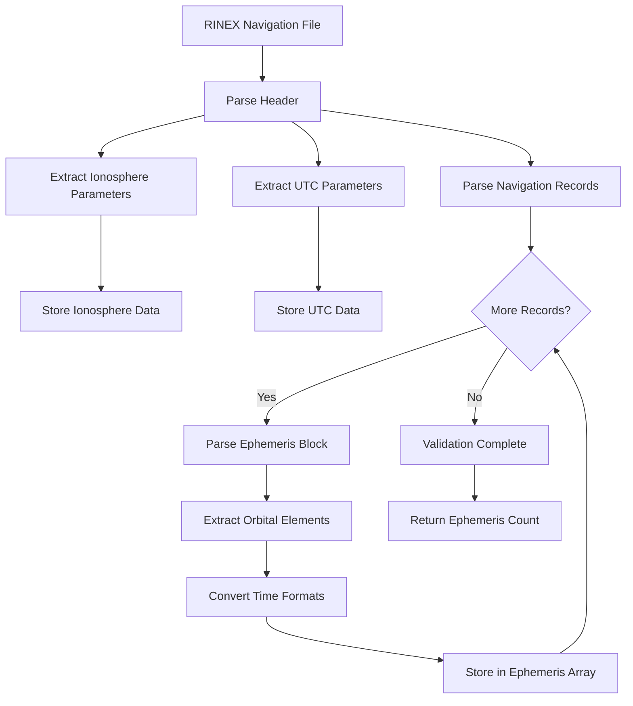
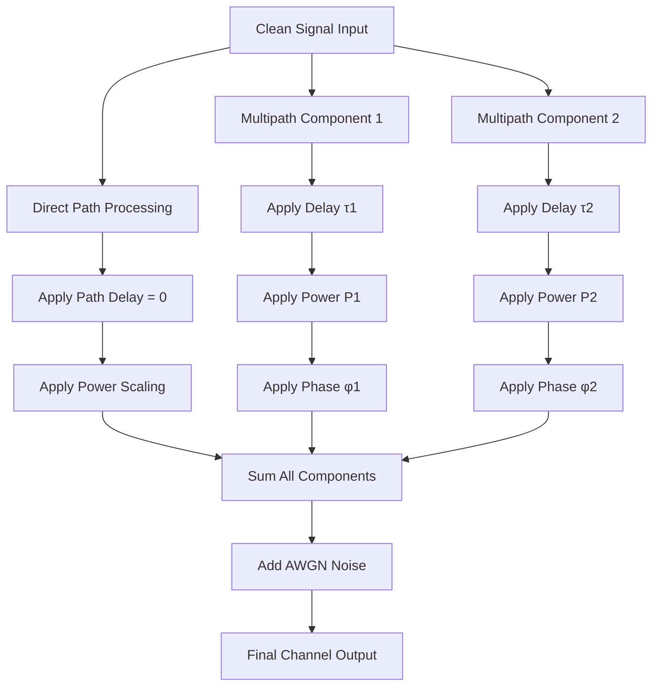
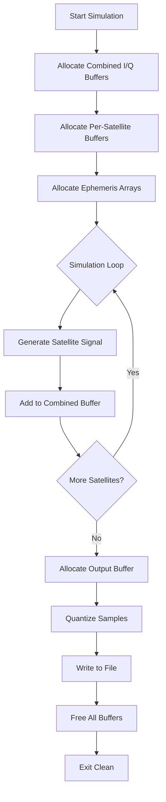
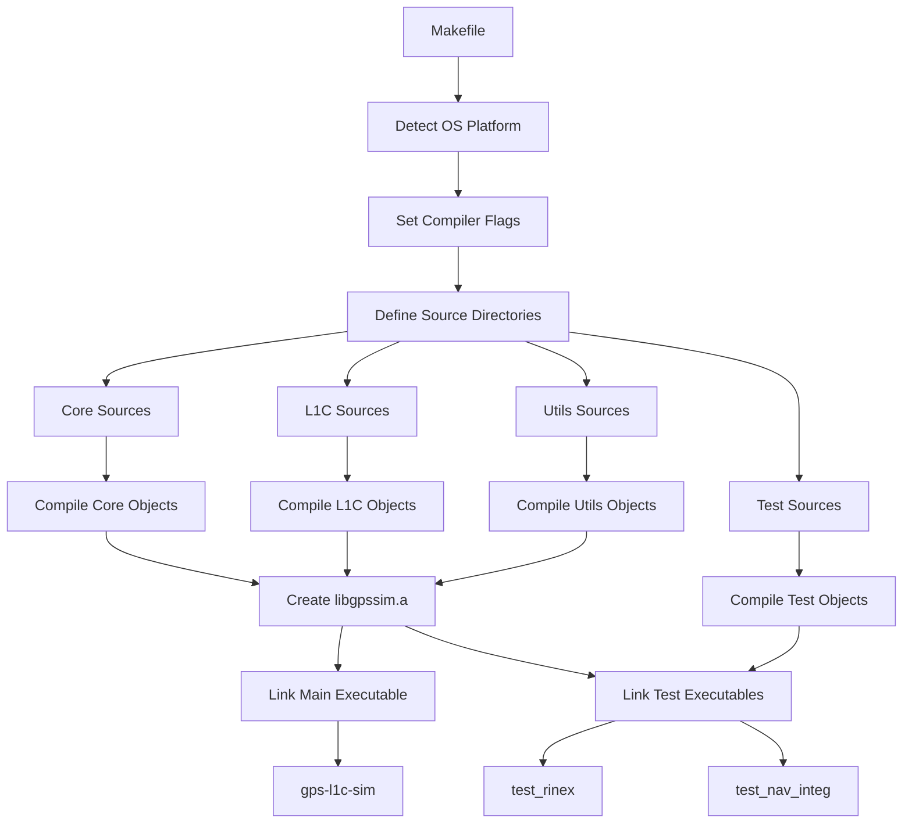
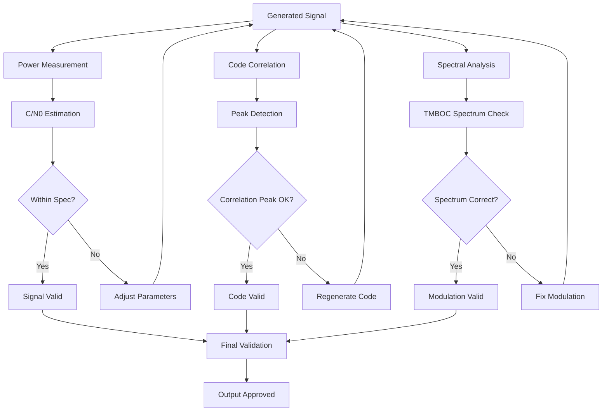

# GPS L1C Simulator Flow Diagrams

## Overall System Flow



## Detailed Signal Processing Flow

```mermaid
graph TB
    subgraph "Satellite Processing"
        A1[PRN Input 1-63] --> B1[Compute Satellite Position/Velocity]
        B1 --> C1[Calculate Range & Doppler]
        C1 --> D1[Compute Atmospheric Delays]
        D1 --> E1[Generate L1C Codes]
    end
    
    subgraph "L1C Code Generation"
        E1 --> F1[Generate 10,230-chip Ranging Code]
        F1 --> G1[Generate 2,047-chip Overlay Code]
        G1 --> H1[L1CD = Ranging Only]
        G1 --> I1[L1CP = Ranging XOR Overlay]
    end
    
    subgraph "Modulation"
        H1 --> J1[BOC(1,1) Modulation]
        I1 --> K1[TMBOC Modulation]
        J1 --> L1[L1CD Waveform]
        K1 --> M1[L1CP Waveform]
    end
    
    subgraph "Baseband Generation"
        L1 --> N1[Generate I/Q Samples]
        M1 --> N1
        N1 --> O1[Apply Carrier & Code Phase]
        O1 --> P1[Apply Doppler Shift]
        P1 --> Q1[Scale Signal Power]
    end
    
    subgraph "Channel Effects"
        Q1 --> R1[Add Multipath Components]
        R1 --> S1[Add AWGN Noise]
        S1 --> T1[Final Satellite Signal]
    end
    
    T1 --> U1[Combine with Other Satellites]
```

## L1C Signal Structure

```mermaid
graph LR
    subgraph "L1C Signal Components"
        A[10,230-chip Ranging Code] --> B[L1CD Data Channel]
        A --> C[L1CP Pilot Channel]
        D[2,047-chip Overlay Code] --> C
        
        B --> E[BOC(1,1) Modulation]
        C --> F[TMBOC Modulation]
        
        E --> G[100 bps Navigation Data]
        F --> H[Dataless Pilot]
        
        G --> I[In-phase Component]
        H --> J[Quadrature Component]
        
        I --> K[Complex Baseband Output]
        J --> K
    end
```

## TMBOC Modulation Detail

```mermaid
graph TD
    A[Input Chip] --> B{Position in 33-chip cycle}
    B -->|Positions 1,11,17,29| C[BOC(1,1)]
    B -->|Other 29 positions| D[BOC(6,1)]
    
    C --> E[2 subcodes per chip]
    D --> F[12 subcodes per chip]
    
    E --> G[+1, -1 pattern]
    F --> H[+1,+1,+1,+1,+1,+1, -1,-1,-1,-1,-1,-1]
    
    G --> I[Output Waveform]
    H --> I
```

## RINEX Data Processing Flow



## Channel Model Implementation



## Memory Management Flow



## Time System Conversions

```mermaid
graph LR
    subgraph "Input Time Formats"
        A[Calendar Date/Time]
        B[GPS Week/Seconds]
    end
    
    subgraph "Conversion Functions"
        A --> C[date2gps()]
        B --> D[Direct Use]
        C --> E[GPS Time Structure]
        D --> E
    end
    
    subgraph "Time Operations"
        E --> F[subGpsTime()]
        E --> G[incGpsTime()]
        F --> H[Time Differences]
        G --> I[Time Advancement]
    end
    
    subgraph "Applications"
        H --> J[Satellite Position Computation]
        I --> K[Simulation Time Stepping]
    end
```

## Build System Dependencies



## Signal Quality and Validation

